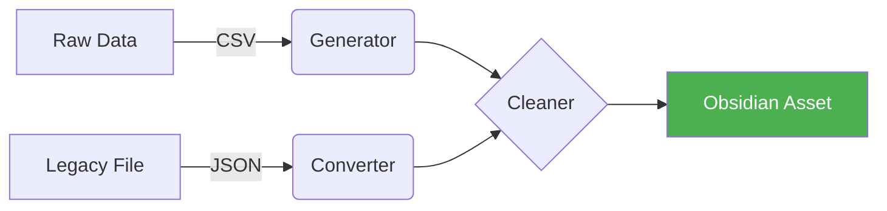

# Skill: Excalidraw Toolkit (視覺化全能工具箱)

## 📋 觸發指令

使用以下任一關鍵字啟動此 Toolkit：

- `處理 excalidraw`
- `視覺化 CSV 數據`
- `清理圖檔格式`
- `excalidraw toolkit`

---

## 🎯 三大核心模組 (Core Modules)

| 模組 | 原始技能 | 核心職責 | 常用指令 |
| :--- | :--- | :--- | :--- |
| **Generator** | `csv-to-excalidraw` | 從 CSV 座標生成圖檔 | `csv_to_excalidraw.py` |
| **Converter** | `legacy-excalidraw-conversion` | 舊版 JSON 轉為 Obsidian MD | `legacy_to_obsidian.py` |
| **Cleaner** | `remove-html-br` | 移除 `<br>` 標籤與格式修復 | `fix_br_tags.py` |

---

## 🔄 整合工作流 (Workflow)



---

## 📝 詳細指令手冊

### 1. 📊 數據生成 (Generator)

將包含 X, Y 座標的 CSV 轉為 Excalidraw 佈置圖：

```bash
python .gemini/skills/excalidraw-toolkit/scripts/csv_to_excalidraw.py "<CSV 檔案>"
```

### 2. 🔄 格式轉換 (Converter)

將舊版 `.excalidraw` (JSON) 升級為新版 `.excalidraw.md`：

```bash
python .gemini/skills/excalidraw-toolkit/scripts/legacy_to_obsidian.py "<舊版檔案>"
```

*提取圖中文字：*

```bash
python .gemini/skills/excalidraw-toolkit/scripts/extract_text.py "<圖檔路徑>"
```

### 3. 🧹 文本清理 (Cleaner)

修復圖檔匯入後的 HTML 換行標籤：

```bash
python .gemini/skills/excalidraw-toolkit/scripts/fix_br_tags.py "<檔案路徑>"
```

---

## 🚫 禁止事項

1. **禁止在 Mermaid 節點中使用括號**：以免干擾 Obsidian 渲染。
2. **禁止覆蓋非 Excalidraw 格式的 Markdown**：轉換前請務必確認檔案類型。
3. **編碼保護**：所有操作必須保持 `UTF-8` (No BOM) 編碼。

---

## 📝 版本歷史

- **v2.1** (2026-03-24):
    - **CLEANUP**: 徹底移除過時的 `handshake` 技能快取同步機制。
    - **ARCH**: 全面套用 `Aesthetic Hardening v2.0` 標準語義標頭。
    - **FIX**: 修復 `fix_br_tags.py` 中的字串跳脫語法警告。
- **v2.0** (2026-02-21):
    - **重大更新 (REFACTOR)**: 整合 `csv-to-excalidraw`, `legacy-excalidraw-conversion`, `remove-html-br` 三大技能。
    - **統一腳本**: 重新命名腳本以消除命名衝突，並建立單一 Toolkit 入口。
- **v1.x**: 原始單一技能版本（已歸檔）。

---
*Last Updated: 2026-03-30 | Platforms: Darwin, Win32 | System Version: v8.5*
