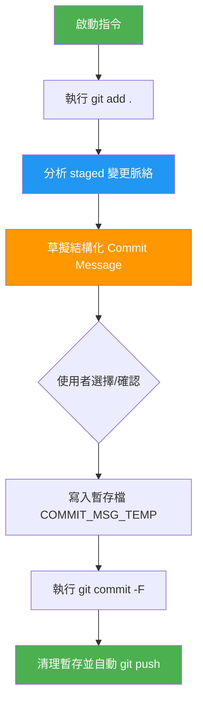

---
tags:
- specification
- architecture
- git
id: KB-SPEC-20260228
---
Summary:: 定義系統級的 Git 提交規範，確立結構化 Commit Message 模板、自動化執行流程與「變更即知識」的同步準則。
Importance:: [治理基石] 確保專案開發歷史具備高度可讀性，並為未來的「歷史變更知識萃取」提供標準化的數據結構與執行流程。

# 🛠️ Git 提交規範規格書 (Git Commit Protocol Spec)

## 1. 核心原則 (Principles)
本規範遵循 **Conventional Commits** 精神，並針對 DCS 數位孿生專案進行結構化擴充。核心目標是：**「讓每一次提交都成為日後可考古的知識碎塊」。**

## 2. 執行流程 (Workflow)



### 2.1 階段一：暫存與同步 (Staging & Sync)
**操作**：`git add .`
* **智慧聯動**：Agent 應檢查變更是否對應現有 Track 任務，並建議更新狀態。

### 2.2 階段二：深度分析 (Deep Analysis)
**操作**：分析 `git diff --staged`。**強制規定**：必須在指令中排除 JSON 等數據檔（例如 `git diff --staged -- . ':(exclude)*.json'`），避免海量數據雜訊干擾分析。
* **分析重點**：變更性質、影響範圍、變更動機。
* **效率限制**：**嚴禁執行 `git log`** 查詢歷史紀錄，只需專注於當前暫存區的核心邏輯與文檔變更。

### 2.3 階段三：草擬選項 (Drafting)
Agent 必須提供至少兩個符合標准格式的選項。

## 3. Commit Message 標準格式

### 3.1 標題層 (Header)
格式：`<type>(<scope>): <short description>`
* **Type**: `feat`, `fix`, `refactor`, `docs`, `style`, `chore`, `task`.
* **Scope**: `workflow`, `engine`, `navigator`, `spec`, `LPxxx`, `Rxxx`.

### 3.2 正文層 (Body - 結構化變更)
必須包含以下區塊：
```markdown
## 核心變更
### 1. [分類 A]
- 具體變更描述 1
- 具體變更描述 2

### 2. [分類 B]
- ...

## 變更理由
- 為什麼要改（動機）
- 解決了什麼問題 / 帶來什麼好處
```

### 3.3 數據統計 (Statistics)
提交時應附帶：
* 影響檔案數、新增/刪除行數。
* 效能提升或知識產出統計。

## 4. 安全與完整性 (Security & Integrity)
1. **憑證保護**：嚴禁提交敏感憑證 (`credentials/`, `.env`, `.git`)。
2. **知識鏈動**：重大重構後，Agent **必須**提示是否執行 `capture knowhow` 進行同步文件化。
3. **安全提交**：強制使用 `.git/COMMIT_MSG_TEMP` 暫存檔進行 `git commit -F` 以確保 UTF-8 編碼與 Markdown 格式正確。
4. **自動推送**：提交成功後應自動執行 `git push`（除非使用者明確要求停止）。

## 5. 歷史考古與 RAG (History Mining)
系統支援依據「日期」或「特定 Commit」進行事後知識萃取。標準化的提交格式是 RAG 引擎能精準理解專案演進史的前提。

---
*Last Updated: 2026-02-28 | Version: v1.1 (Integrated with Skill Specification)*
