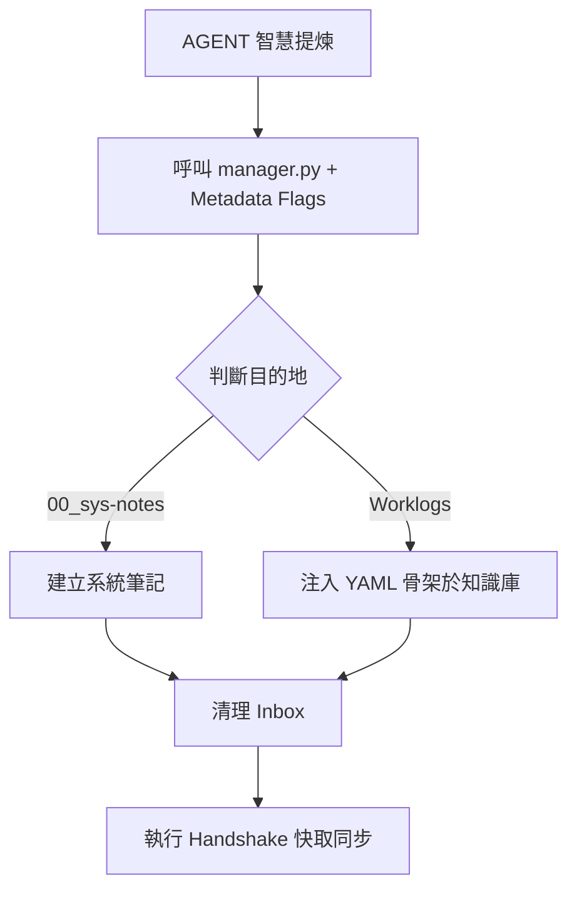

# Daily Log Archiver Skill (Knowledge Router & Skeletonizer)

## 🛡️ 智慧提煉與收割協定 (Smart Synthesis & Capture Protocol)

當使用者要求「Capture」或「收割」時，AGENT 絕對禁止機械式運行指令。必須遵循以下 **「提煉優先」** 流程：

1.  **智慧提煉 (Intelligent Extraction)**：
    -   AGENT 必須先分析 `00_Inbox/AskGemini.md` 或當前對話內容。
    -   **必須** 產出具備「戰略高度」的摘要與評核。
2.  **參數注入 (Argument Injection)**：
    -   執行 `manager.py` 時，**必須** 將提煉內容注入 `--summary`, `--importance` 與 `--positioning` 參數。
    -   若 type 為 `research` 或 `spec`，嚴禁使用預設佔位符。
3.  **結構化正文 (Structured Body)**：
    -   **必須** 使用 Markdown 表格呈現參數對位。
    -   **必須** 包含「設計理由 (Rationale)」或「工程意圖 (Engineering Intent)」。

---

## 📋 觸發指令與範例

本技能採用標準化入口架構，支援**「智慧收割矩陣」**。

### 軌道一：系統日誌 (System Log)
適合快速清理 Inbox，不需深度提煉。
- **指令**: `python .gemini/skills/kb-capture/scripts/manager.py --action capture`

### 軌道二：精品知識收割 (Curated Harvest)
**[強制要求]** 必須包含智慧參數。
- **範例**:
  ```powershell
  python .gemini/skills/kb-capture/scripts/manager.py `
    --action capture `
    --type research `
    --topic "Neuro-Symbolic-Integration" `
    --summary "實現 RAG 與時域模擬引擎的雙核聯動，解決高階幻覺問題。" `
    --importance "工業級高精度領域的關鍵里程碑，具備 100% 物理一致性。"
  ```

---

## 🎯 適用範圍與分發策略 (Routing Strategy)

| 指令/意圖 | 參數 (`--type`) | 輸出動作與路徑 | 特性 (Features) |
| :--- | :--- | :--- | :--- |
| `capture` | `log` (預設) | 導向 `conductor/archive/00_sys-notes/`。 | 預設系統歸檔。 |
| `capture <type>` | `idea`, `knowhow`, `spec`, `bug`, `research` | 導向 `20_Knowledge_Base/0_Worklogs/<type>/`。 | 依據 `knowledge_types.json` 注入欄位。 |

---

## 🔄 執行流程 (v5.5 Pipeline)



---

## 🚫 禁止事項

1.  **禁止佔位符收割**：針對非 `log` 類型資產，嚴禁直接運行無參數指令，導致 YAML 充滿 `[待補全]`。
2.  **禁止路徑錯位**：系統級筆記必須嚴格存放於 `00_sys-notes/`。

---

## 5. 版本紀錄 (Changelog)

- **v5.5 (2026-04-14)**:
    - **PROTOCOL**: 引入「智慧提煉協定」，強制 AGENT 在收割前提供 Metadata。
    - **UX**: 優化 CLI 參數範例，將智慧注入標註為標準。
- **v5.1 (2026-03-24)**:
    - **ARCH**: 全面重構為 `scripts/manager.py` 入口架構。

---
*Last Updated: 2026-04-14 | System Version: v8.6*

